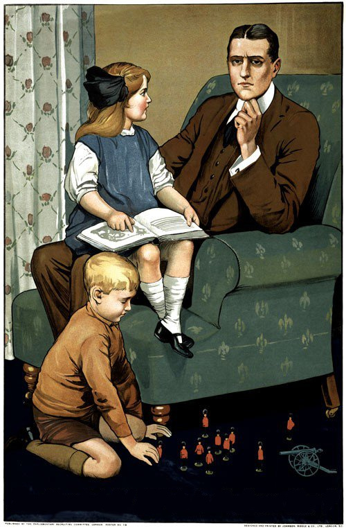
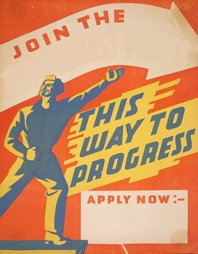

# Posters for a Fedora community blog article

As we will be writing an article for Fedora community blog, I thought it would be fun to accompany it with a picture. As I like propaganda posters, I picked a few that could be retouched with a new text.

Tell me if you like any of them or not. They are a bit cheesy, as I kind of like that :) If not, we can put some normal Python logo/something in there.

Click for a larger version.

Daddy, what did YOU do when they ported Python?

---

Join the Python porting party!

---

He volunteered for Python porting

---

We Can Do It!
